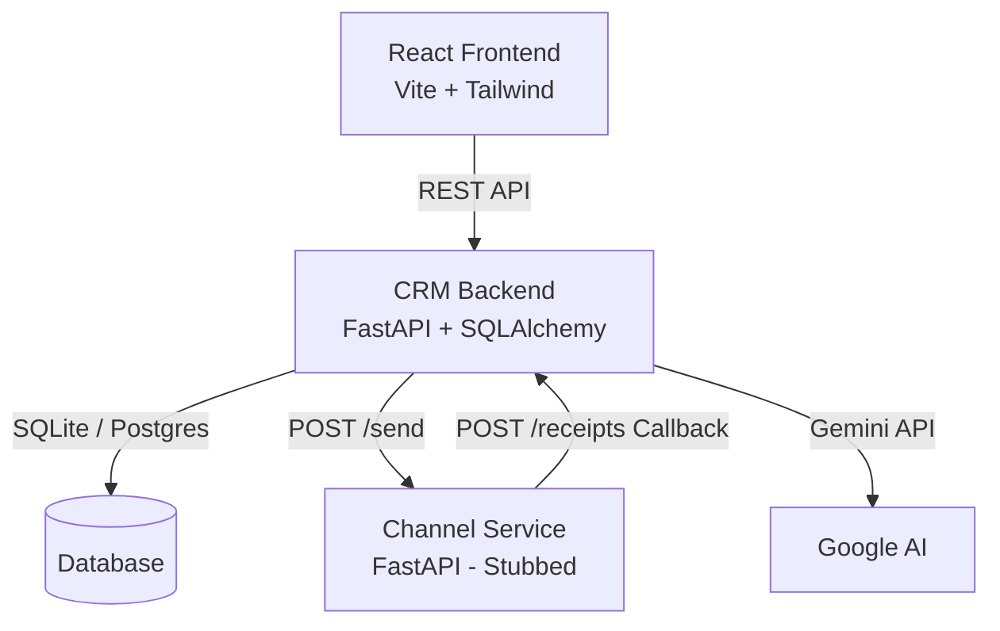

# Xeno AI CRM — Production-Ready AI-Native Mini CRM

Xeno AI CRM is a customer engagement platform designed for marketers to upload customer data, segment audiences using natural language, draft campaigns using generative AI, simulate message delivery, track campaign conversion funnels, and analyze results using AI-generated summaries.

---

## 🛠️ Technology Stack

**Frontend**
- **React 18**: Component-based UI library.
- **Vite**: Ultra-fast build tool and development server.
- **TypeScript**: Static typing for robust code.
- **Tailwind CSS**: Utility-first CSS framework for rapid styling.
- **Lucide React**: Beautiful and consistent iconography.
- **Recharts**: Composable charting library for performance metrics.

**Backend**
- **Python 3.12+**: Core language.
- **FastAPI**: High-performance asynchronous web framework.
- **SQLAlchemy 2.0**: Next-generation ORM for Python.
- **Uvicorn**: Lightning-fast ASGI server.
- **Google Generative AI (Gemini)**: Powers the natural language segmentation, message drafting, and campaign insights.

**Database & Infrastructure**
- **SQLite / PostgreSQL**: Relational database storage (SQLite configured locally, PostgreSQL ready for production).
- **Asynchronous Tasks**: Built-in asyncio background tasks for handling bulk campaign dispatches.

---

## 🏛️ System Architecture



### Component Details
1. **React Frontend (Vite)**: Structured with a left-fixed navigation sidebar and tab routing. Includes animated progress metrics for live campaigns, pagination, search, and a drawer panel for customer order history timelines.
2. **CRM Backend (FastAPI)**: Manages database transactions, imports customer spreadsheets, processes natural language queries into SQL database filters, schedules campaign launches via asynchronous background tasks, handles callback receipts, and updates store metrics.
3. **Channel Service (FastAPI)**: Simulates a separate telecommunication delivery network. It queue-sends messages and asynchronously reports simulated delivery statuses (`delivered`, `opened`, `read`, `clicked`, `conversion`, `failed`) back to the CRM database callback endpoint using random probabilities and custom network delays.

---

## 🚀 Setup & Execution Guide

### Prerequisites
- Python 3.12+
- Node.js 18+

### Step 1: Install Python Dependencies & Seed Database
From the root workspace folder, run:
```powershell
# Create python virtual environment
python -m venv venv

# Activate virtual environment
.\venv\Scripts\activate

# Install backend dependencies
pip install -r backend\requirements.txt

# Seed the database (Generates 1000 customers & 5000 orders)
cd backend
python seed.py
cd ..
```

### Step 2: Configure Gemini API Key (Optional)
If you want to use live Gemini AI models:
```powershell
# Windows PowerShell
$env:GEMINI_API_KEY="your_api_key_here"
```
*Note: If no API key is specified, the backend automatically falls back to an intelligent rule-based regex compiler and local templates. The app is fully testable and functional out of the box.*

### Step 3: Run the Servers

1. **CRM Backend Service** (Port 8000):
   ```powershell
   cd backend
   ..\venv\Scripts\uvicorn app.main:app --host 0.0.0.0 --port 8000 --reload
   ```

2. **Channel Service Simulator** (Port 8001):
   ```powershell
   cd channel_service
   ..\venv\Scripts\uvicorn app.main:app --host 0.0.0.0 --port 8001 --reload
   ```

3. **React Frontend Dev Server** (Port 5173):
   ```powershell
   cd frontend
   npm install
   npm run dev
   ```

Open `http://localhost:5173` in your browser.

---

## 🤖 AI Features Implementation

### 1. Natural Language Segmentation (`/api/ai/segment`)
Marketers can type plain-text statements (e.g., *"Inactive for 60 days with spend over 5000"*).
- **AI Core**: The request prompt goes to Gemini, which returns a structured JSON payload: `{"inactive_days": 60, "min_spend": 5000}`.
- **Backend Query**: The FastAPI router uses these variables to execute dynamic SQLAlchemy queries against the `Customer` and `Order` tables, returning the matching count and description.

### 2. Campaign Message Generation (`/api/ai/message`)
Marketers define an audience, an offer, and a choice of tone (casual, formal, urgent).
- **AI Core**: Gemini drafts personalized messages incorporating a `{name}` placeholder tag. Different layouts are prepared (e.g., WhatsApp with emojis, SMS texts under character limits, or Email templates with subject lines).
- **Pills Toggle**: The UI provides immediate buttons to regenerate variations or toggle tones.

### 3. Explainer & Insights (`/api/ai/insights`)
- **AI Core**: Marketers can click *"Explain Performance"* on campaigns. AI processes the conversion numbers (Open Rate, CTR, Conversions) and generates a narrative evaluation with specific recommendations (e.g., advising landing page speedups if clicks are high but conversions are low).

---

## 🔌 Callback Lifecycle & System Reliability

### 1. Message Lifecycle Flow
When a campaign is launched:
```
CRM (Launch) ➔ Create Communications (Status: pending)
  │
  ├─► Background Worker (Batch Size: 10) ➔ POST /send
  │     │
  │     ▼
  │   Channel Service (Queues Task)
  │     │
  │     ├─► [Network Delay 0.5 - 2s]
  │     │     ├─► 90% Success: Callback ➔ CRM receipts (Status: delivered)
  │     │     └─► 10% Failure: Callback ➔ CRM receipts (Status: failed)
  │     │           │
  │     │           └─► CRM Retry (Max 3 attempts, 2s sleep)
  │     │
  │     └─► If Delivered:
  │           ├─► Opened (70% probability) ➔ Callback ➔ CRM (Status: opened)
  │           └─► Read (60% probability) ➔ Callback ➔ CRM (Status: read)
  │           └─► Clicked (30% probability) ➔ Callback ➔ CRM (Status: clicked)
  │           └─► Conversion (15% probability) ➔ Callback ➔ CRM (Creates Order)
```

### 2. Order Attribution & Feedback Loop
When the Channel Service registers a simulated customer purchase (`conversion`), it reports the transaction details and amount:
1. The CRM callback endpoint (`/api/receipts`) catches the payload.
2. It logs a new `Event` of type `conversion`.
3. It **attributes the conversion back to the store** by creating a new `Order` records for that customer.
4. The customer's `total_spend` and `last_purchase_date` are updated dynamically in the database, allowing future segmentation runs to adapt to campaign results!

### 3. Retry Operations
- If the HTTP request from CRM to Channel Service fails (connection timed out, service down), or the service reports a `failed` dispatch status:
  - The CRM logs the attempt number.
  - It retries the dispatch up to **3 times** with a **2-second sleep delay**.
  - If it fails after 3 attempts, it marks the communication as `failed` in the database.

---

## ⚖️ Production Tradeoffs

| Feature | Implementation in Mini CRM | Enterprise Scalability Strategy |
|---|---|---|
| **Message Queue** | Asynchronous asyncio task batches | Distributed message broker (Celery / RabbitMQ / Redis Streams) |
| **Real-Time Client Updates** | Client-side polling (every 4 seconds) | WebSockets (via FastAPI's `WebSocketRoute`) or Server-Sent Events (SSE) |
| **High Volume Retries** | Synchronous retries with basic sleep | Dead Letter Queues (DLQ) with exponential backoff and jitter |
| **Database** | File-based SQLite (local) | Multi-node PostgreSQL with pgPool / PgBouncer connection pooling |
| **Batch Processing** | Chunked arrays in-memory | Distributed map-reduce workers processing cursor-based streaming |
